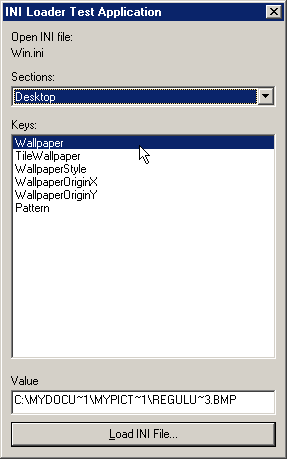



## An INI file manager \-\- no API's\!\!\!

### Description

This code provides pure VB source for the following API calls: GetPrivateProfileSection, GetPrivateProfileString, WritePrivateProfileSection, and WritePrivateProfileString. With this code, YOU CAN ACCESS LARGER *.INI FILES!!! Unlike the traditional API commands, there is no limit to the size of *.INI file that you can access/create. Also, believe it or not, the windows API calls for INI file manipulation lack in speed. These functions are PLENTY times faster then the same functions provided in Kernel32.dll. If this isn't significant, I've added the following extremely usefull INI functions/commands of my own: GetPrivateProfileKeys, GetPrivateProfileSections, RemovePrivateProfileSection, RemovePrivateProfileString. Now you can find out very easy which keys are inside an *.INI file! A sampler program is included, which allows you to view INI files, their keys and their values. Also, you can delete unwanted sections and keys to help keep your INI file clean and compact!!! This code is heavily commented, logical, and easy to understand. Try it out today!
 
### More Info
 

             |
---                |---
**Submitted On**   |2001-07-14 07:28:56
**By**             |[Jon Feucht](https://github.com/Planet-Source-Code/PSCIndex/blob/master/ByAuthor/jon-feucht.md)
**Level**          |Advanced
**User Rating**    |4.8 (43 globes from 9 users)
**Compatibility**  |VB 5\.0, VB 6\.0
**Category**       |[VB function enhancement](https://github.com/Planet-Source-Code/PSCIndex/blob/master/ByCategory/vb-function-enhancement__1-25.md)
**World**          |[Visual Basic](https://github.com/Planet-Source-Code/PSCIndex/blob/master/ByWorld/visual-basic.md)
**Archive File**   |[An INI fil227707142001\.zip](https://github.com/Planet-Source-Code/jon-feucht-an-ini-file-manager-no-api-s__1-25017/archive/master.zip)

